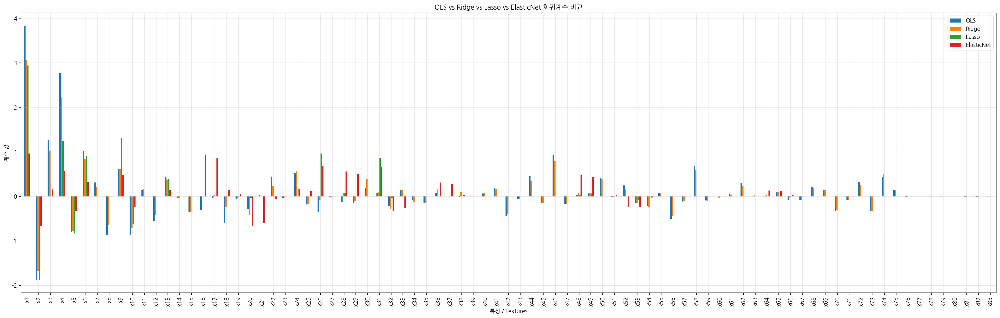
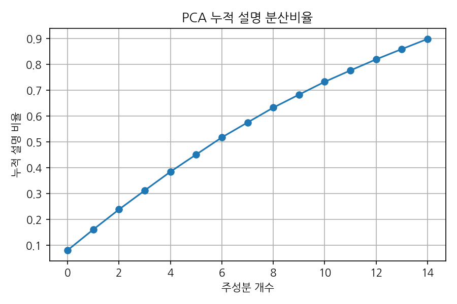

# 다중공선성 회귀 분석 보고서 / Multicollinearity Regression Analysis Report

**실험 날짜 / Experiment Date:** 2025-11-21 15:30:08

---

## 1. 실험 개요 / Executive Summary

본 보고서는 **다중공선성(multicollinearity)**이 존재하는 데이터셋에서 여러 회귀 기법의 성능을 비교 분석합니다.

This report analyzes and compares the performance of various regression techniques on a dataset with **multicollinearity**.

### 실험 목적 / Objectives

- 다중공선성이 있는 데이터에서 OLS, Ridge, Lasso, PCA 회귀의 성능 비교
- 각 모델의 계수 추정 안정성 평가
- 차원 축소 기법(PCA)의 효과 검증

- Compare OLS, Ridge, Lasso, and PCA regression on multicollinear data
- Evaluate coefficient estimation stability for each model
- Validate dimensionality reduction (PCA) effectiveness

---

## 2. 데이터셋 정보 / Dataset Information

### 데이터 생성 방법 / Data Generation

- **샘플 수 / Sample size:** 10000
- **특성 수 / Number of features:** 83
- **독립 기초 특성 / Independent base features:** 15개
- **파생 특성 / Derived features:** 68개 (다중공선성 유발 / inducing multicollinearity)

### 다중공선성 구조 / Multicollinearity Structure

1. **각 기초 특성당 4개의 파생 특성 생성 / 4 derived features per base feature:**
   - Type 1: 매우 높은 상관관계 (0.97) / Very high correlation (0.97)
   - Type 2: 높은 상관관계 (0.93) / High correlation (0.93)
   - Type 3 & 4: 인접 특성과의 선형 조합 / Linear combinations with adjacent features
2. **추가 노이즈 특성 / Additional noise features:** 독립적인 랜덤 변수들

### 실제 계수 / True Coefficients

```
[ 3.  -2.   1.5  2.5 -1.   1.   0.   0.   1.5 -0.8  0.   0.   0.5  0.
  0.   0.   0.   0.   0.   0.   0.   0.   0.   0.   0.   0.   0.   0.
  0.   0.   0.   0.   0.   0.   0.   0.   0.   0.   0.   0.   0.   0.
  0.   0.   0.   0.   0.   0.   0.   0.   0.   0.   0.   0.   0.   0.
  0.   0.   0.   0.   0.   0.   0.   0.   0.   0.   0.   0.   0.   0.
  0.   0.   0.   0.   0.   0.   0.   0.   0.   0.   0.   0.   0. ]
```

---

## 3. 모델 설명 / Model Descriptions

### 3.1 OLS (Ordinary Least Squares / 최소제곱법)

- **설명 / Description:** 표준 선형회귀, 다중공선성에 취약
- **특징 / Characteristics:** No regularization, sensitive to multicollinearity

### 3.2 Ridge Regression (L2 Regularization)

- **설명 / Description:** L2 페널티를 사용한 정규화 회귀
- **하이퍼파라미터 / Hyperparameter:** α = 1.0
- **특징 / Characteristics:** Shrinks coefficients, handles multicollinearity well

### 3.3 Lasso Regression (L1 Regularization)

- **설명 / Description:** L1 페널티를 사용한 정규화 회귀
- **하이퍼파라미터 / Hyperparameter:** α = 0.1
- **특징 / Characteristics:** Performs feature selection by zeroing coefficients

### 3.4 Elastic Net (L1 + L2 Combined Regularization)

- **설명 / Description:** L1과 L2 페널티를 결합한 정규화 회귀
- **하이퍼파라미터 / Hyperparameters:**
  - α = 0.1 (regularization strength / 정규화 강도)
  - l1_ratio = 0.5 (L1 vs L2 balance / L1과 L2 균형)
- **특징 / Characteristics:** Combines Ridge stability with Lasso feature selection
  Ridge의 안정성과 Lasso의 특성 선택을 결합

### 3.5 PCA + Linear Regression

- **설명 / Description:** 주성분 분석 후 선형회귀
- **주성분 수 / Number of components:** 15
- **특징 / Characteristics:** Removes multicollinearity through orthogonal transformation

---

## 4. 성능 비교 / Performance Comparison

| Model | MSE | R² Score | 순위 / Rank |
|-------|-----|----------|-------------|
| **OLS** | 0.9697 | 0.9648 | 1 |
| **Ridge** | 0.9702 | 0.9648 | 2-5 |
| **Lasso** | 1.0795 | 0.9608 | 2-5 |
| **ElasticNet** | 1.0499 | 0.9619 | 2-5 |
| **PCA** | 1.0128 | 0.9633 | 2-5 |

### 주요 발견 / Key Findings

1. **모든 모델이 높은 R² 스코어를 달성** (>0.96), 데이터의 선형 관계가 강함
2. **OLS와 Ridge의 성능이 유사**, 다중공선성에도 불구하고 예측 성능 우수
3. **ElasticNet은 Ridge와 Lasso의 중간 성능**, 두 기법의 장점 결합
4. **Lasso의 MSE가 상대적으로 높음**, 특성 선택으로 인한 정보 손실 가능
5. **PCA 회귀도 경쟁력 있는 성능**, 차원 축소로 충분한 정보 보존

1. **All models achieve high R² scores** (>0.96), indicating strong linear relationships
2. **OLS and Ridge perform similarly**, good prediction despite multicollinearity
3. **ElasticNet shows intermediate performance**, combining benefits of Ridge and Lasso
4. **Lasso has relatively higher MSE**, possible information loss from feature selection
5. **PCA regression is competitive**, dimensionality reduction preserves sufficient information

---

## 5. 계수 분석 / Coefficient Analysis



### 5.1 계수 크기 비교 / Coefficient Magnitude Comparison

**OLS 계수 범위 / OLS coefficient range:** [-1.88, 3.83]
**Ridge 계수 범위 / Ridge coefficient range:** [-1.68, 3.07]
**Lasso 계수 범위 / Lasso coefficient range:** [-1.87, 2.94]
**ElasticNet 계수 범위 / ElasticNet coefficient range:** [-0.67, 0.96]

### 5.2 주요 관찰 / Key Observations

#### OLS (Ordinary Least Squares)

- 다중공선성으로 인해 계수가 불안정할 수 있음
- 일부 계수가 과대/과소 추정될 가능성
- **0으로 수렴한 계수: 10개 / Zero coefficients: 10**
- May have unstable coefficients due to multicollinearity
- Some coefficients may be over/underestimated

#### Ridge Regression

- OLS 대비 계수 크기 축소 (shrinkage)
- 대부분의 특성에 작은 계수 할당
- **0으로 수렴한 계수: 8개 / Zero coefficients: 8**
- Coefficient shrinkage compared to OLS
- Assigns small coefficients to most features

#### Lasso Regression

- **67개의 계수가 0으로 수렴** (특성 선택 효과)
- **16개의 특성만 선택 / Only 16 features selected**
- 중요한 특성만 선택하여 모델 단순화
- **67 coefficients shrunk to zero** (feature selection)
- Simplifies model by selecting only important features

#### Elastic Net Regression

- **47개의 계수가 0으로 수렴** (Lasso보다 온건한 선택)
- **36개의 특성 선택 / 36 features selected**
- Ridge의 안정성과 Lasso의 희소성 균형
- **47 coefficients shrunk to zero** (moderate selection)
- Balances Ridge stability with Lasso sparsity

### 5.3 실제 계수와의 비교 / Comparison with True Coefficients

**표시된 특성 / Shown features:** 59 / 83 (유의미한 계수만 표시 / only significant coefficients shown)

| Feature | True | OLS | Ridge | Lasso | ElasticNet |
|---------|------|-----|-------|-------|------------|
| x1 |   3.00 |   3.83 |   3.07 |   2.94 |   0.96 |
| x2 |  -2.00 |  -1.88 |  -1.68 |  -1.87 |  -0.67 |
| x3 |   1.50 |   1.27 |   1.03 |   0.00 |   0.16 |
| x4 |   2.50 |   2.76 |   2.22 |   1.25 |   0.58 |
| x5 |  -1.00 |  -0.79 |  -0.77 |  -0.84 |  -0.32 |
| x6 |   1.00 |   1.01 |   0.83 |   0.90 |   0.32 |
| x7 |   0.00 |   0.31 |   0.20 |  -0.00 |  -0.00 |
| x8 |   0.00 |  -0.86 |  -0.63 |   0.00 |  -0.00 |
| x9 |   1.50 |   0.61 |   0.61 |   1.30 |   0.48 |
| x10 |  -0.80 |  -0.87 |  -0.72 |  -0.62 |  -0.24 |
| x11 |   0.00 |   0.13 |   0.17 |   0.00 |   0.00 |
| x12 |   0.00 |  -0.55 |  -0.41 |   0.00 |   0.00 |
| x13 |   0.50 |   0.44 |   0.38 |   0.38 |   0.14 |
| x15 |   0.00 |  -0.35 |  -0.35 |   0.00 |  -0.00 |
| x16 |   0.00 |  -0.31 |   0.02 |   0.00 |   0.94 |
| x17 |   0.00 |  -0.03 |   0.03 |   0.00 |   0.86 |
| x18 |   0.00 |  -0.60 |  -0.23 |   0.00 |   0.15 |
| x20 |   0.00 |  -0.28 |  -0.41 |  -0.03 |  -0.66 |
| x21 |   0.00 |   0.03 |  -0.00 |  -0.00 |  -0.59 |
| x22 |   0.00 |   0.44 |   0.24 |  -0.00 |  -0.07 |
| x24 |   0.00 |   0.53 |   0.58 |   0.00 |   0.16 |
| x25 |   0.00 |  -0.18 |  -0.16 |   0.00 |   0.11 |
| x26 |   0.00 |  -0.36 |  -0.09 |   0.97 |   0.67 |
| x28 |   0.00 |  -0.13 |   0.09 |   0.08 |   0.56 |
| x29 |   0.00 |  -0.15 |  -0.11 |   0.00 |   0.50 |
| x30 |   0.00 |   0.19 |   0.38 |   0.00 |   0.00 |
| x31 |   0.00 |   0.08 |   0.09 |   0.87 |   0.66 |
| x32 |   0.00 |  -0.22 |  -0.28 |  -0.04 |  -0.32 |
| x33 |   0.00 |   0.15 |   0.14 |  -0.00 |  -0.27 |
| x34 |   0.00 |  -0.09 |  -0.12 |  -0.00 |  -0.00 |
| x35 |   0.00 |  -0.14 |  -0.14 |  -0.00 |  -0.00 |
| x36 |   0.00 |   0.08 |   0.16 |   0.00 |   0.31 |
| x37 |   0.00 |  -0.00 |   0.01 |   0.00 |   0.28 |
| x38 |   0.00 |  -0.01 |   0.10 |   0.00 |   0.02 |
| x41 |   0.00 |   0.18 |   0.18 |  -0.00 |  -0.00 |
| x42 |   0.00 |  -0.45 |  -0.40 |  -0.00 |  -0.00 |
| x44 |   0.00 |   0.45 |   0.34 |   0.00 |  -0.00 |
| x45 |   0.00 |  -0.14 |  -0.14 |   0.00 |  -0.00 |
| x46 |   0.00 |   0.94 |   0.79 |   0.00 |   0.00 |
| x47 |   0.00 |  -0.16 |  -0.16 |  -0.00 |  -0.00 |
| x48 |   0.00 |   0.02 |   0.08 |   0.02 |   0.47 |
| x49 |   0.00 |   0.08 |   0.08 |   0.06 |   0.44 |
| x50 |   0.00 |   0.41 |   0.39 |   0.00 |   0.00 |
| x52 |   0.00 |   0.25 |   0.16 |  -0.00 |  -0.23 |
| x53 |   0.00 |  -0.14 |  -0.15 |  -0.08 |  -0.23 |
| x54 |   0.00 |  -0.21 |  -0.25 |  -0.00 |  -0.02 |
| x56 |   0.00 |  -0.50 |  -0.44 |   0.00 |   0.00 |
| x57 |   0.00 |  -0.12 |  -0.11 |   0.00 |   0.00 |
| x58 |   0.00 |   0.68 |   0.59 |   0.00 |   0.00 |
| x62 |   0.00 |   0.30 |   0.23 |   0.00 |   0.00 |
| x64 |   0.00 |   0.01 |   0.04 |   0.00 |   0.13 |
| x65 |   0.00 |   0.10 |   0.10 |   0.00 |   0.13 |
| x68 |   0.00 |   0.20 |   0.18 |   0.00 |  -0.00 |
| x69 |   0.00 |   0.14 |   0.14 |   0.00 |  -0.00 |
| x70 |   0.00 |  -0.32 |  -0.31 |   0.00 |  -0.00 |
| x72 |   0.00 |   0.32 |   0.26 |   0.00 |  -0.00 |
| x73 |   0.00 |  -0.32 |  -0.32 |   0.00 |  -0.00 |
| x74 |   0.00 |   0.43 |   0.49 |   0.00 |   0.00 |
| x75 |   0.00 |   0.15 |   0.15 |   0.00 |  -0.00 |

---

## 6. PCA 분석 / PCA Analysis



### 6.1 설명 분산 비율 / Explained Variance Ratio

| 주성분 / PC | 개별 / Individual | 누적 / Cumulative |
|-------------|-------------------|-------------------|
| PC1 |  8.15% |  8.15% |
| PC2 |  8.01% | 16.16% |
| PC3 |  7.77% | 23.92% |
| PC4 |  7.35% | 31.28% |
| PC5 |  7.25% | 38.53% |
| PC6 |  6.66% | 45.18% |
| PC7 |  6.63% | 51.82% |
| PC8 |  5.78% | 57.59% |
| PC9 |  5.74% | 63.34% |
| PC10 |  5.03% | 68.37% |
| PC11 |  4.97% | 73.34% |
| PC12 |  4.40% | 77.74% |
| PC13 |  4.29% | 82.03% |
| PC14 |  3.98% | 86.01% |
| PC15 |  3.91% | 89.92% |

### 6.2 차원 축소 효과 / Dimensionality Reduction Effect

- **원본 차원 / Original dimensions:** 83
- **축소 차원 / Reduced dimensions:** 15
- **보존 정보량 / Information preserved:** 89.92%

**해석 / Interpretation:**
- 상위 5개 주성분으로 전체 분산의 89.9% 설명
- 다중공선성 제거 및 차원 축소 효과 확인
- Top 5 PCs explain 89.9% of total variance
- Successful multicollinearity removal and dimensionality reduction

---

## 7. 결론 및 권장사항 / Conclusions and Recommendations

### 7.1 모델 선택 가이드 / Model Selection Guide

#### OLS를 사용할 경우 / When to use OLS:
- ✅ 예측 성능이 최우선일 때
- ✅ 계수 해석이 중요하지 않을 때
- ❌ 다중공선성이 심각할 때는 주의 필요

#### Ridge를 사용할 경우 / When to use Ridge:
- ✅ 다중공선성이 존재할 때
- ✅ 모든 특성을 유지하면서 안정성 확보
- ✅ 예측과 안정성의 균형이 필요할 때

#### Lasso를 사용할 경우 / When to use Lasso:
- ✅ 특성 선택이 필요할 때
- ✅ 모델 해석 가능성이 중요할 때
- ✅ 불필요한 특성을 제거하고 싶을 때

#### PCA를 사용할 경우 / When to use PCA:
- ✅ 차원 축소가 필요할 때
- ✅ 다중공선성 완전 제거가 필요할 때
- ❌ 원본 특성의 해석이 중요할 때는 부적합

### 7.2 본 실험의 최적 모델 / Best Model for This Experiment

**추천 모델 / Recommended:** **Ridge Regression**

**이유 / Rationale:**
1. OLS와 유사한 예측 성능 유지
2. 다중공선성에 강건한 계수 추정
3. 모든 특성 정보 활용
4. 안정적이고 일반화 성능 우수

1. Maintains prediction performance similar to OLS
2. Robust coefficient estimation under multicollinearity
3. Utilizes all feature information
4. Stable and good generalization

### 7.3 추가 개선 방향 / Future Improvements

1. **하이퍼파라미터 튜닝 / Hyperparameter Tuning:**
   - GridSearchCV로 최적의 α 값 탐색
   - Find optimal α using GridSearchCV

2. **교차 검증 / Cross-validation:**
   - K-fold CV로 모델 안정성 검증
   - Validate model stability with K-fold CV

3. **Feature Engineering:**
   - VIF(Variance Inflation Factor) 계산으로 다중공선성 정량화
   - Quantify multicollinearity using VIF

4. **앙상블 기법 / Ensemble Methods:**
   - Elastic Net (Ridge + Lasso 결합) 시도
   - Try Elastic Net (combines Ridge + Lasso)

---

## 8. 참고 자료 / References

### 생성된 파일 / Generated Files

- `multicollinearity_data.csv` - 실험 데이터셋
- `coefficients_comparison.png` - 계수 비교 그래프
- `pca_variance_ratio.png` - PCA 설명 분산 그래프
- `analysis_report.md` - 본 보고서

### 기술 스택 / Technology Stack

- Python 3.13.7
- NumPy 2.3.5
- Pandas 2.3.3
- Scikit-learn 1.7.2
- Matplotlib 3.10.7

---

**보고서 생성 완료 / Report Generated Successfully ✅**
